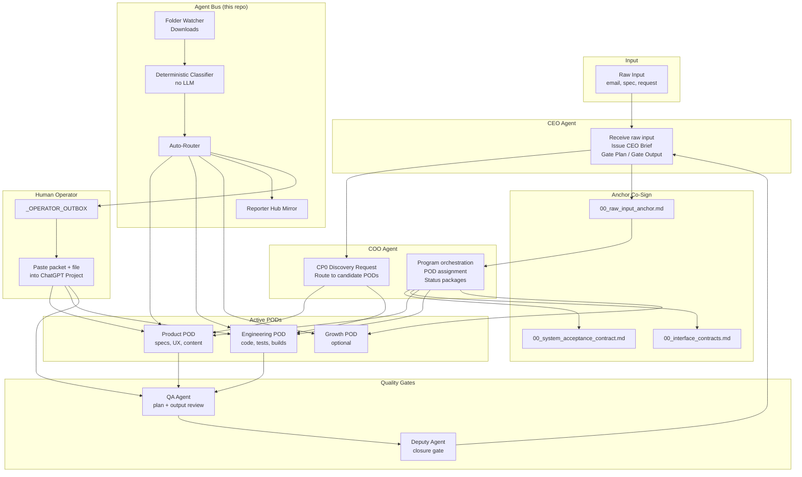

# Architecture — Multi-Agent Workflow & Agent Bus

> How a personal "AI company" coordinates 9–13 specialized agent roles, and where Agent Bus fits in the file-routing layer.

---

## System Overview

The workflow simulates an organizational structure using separate ChatGPT/Claude Projects — each Project embodies one role (CEO, COO, Product Lead, Engineering Lead, QA, Deputy, etc.). Human operator acts as the "human bus": copying files between agent inboxes and pasting content into the right Project.

**Agent Bus automates the mechanical routing layer** so the operator does not manually sort files into `{project}/{pod}/{role}_INBOX/` folders.



---

## Workflow Phases

### Phase 0 — Discovery (CP0)

1. **CEO Agent** receives raw input (client request, feature idea, bug report).
2. **COO Agent** runs CP0: identifies candidate PODs, requests feasibility notes — **no task assignment yet**.
3. Candidate Pod Leads return INPUT SPEC / FEASIBILITY NOTE only.
4. **CEO + COO co-sign** the raw input anchor before any CEO Brief is issued.

### Phase 1 — Planning

1. CEO issues **CEO Brief** (scope, priorities, constraints).
2. COO assigns **Active PODs** and distributes POD ASSIGNMENT forms.
3. Pod Leads produce **Pod Plans** referencing SAC IDs and interface contracts.
4. **Gate Plan:** QA reviews plan → Deputy review → CEO approval.

### Phase 2 — Execution

1. Pod Leads delegate to Builders/Specialists within their POD.
2. Internal pod loops (clarification, iteration) stay within the POD — no QA bypass.
3. Pod Leads deliver **Pod Output** with SAC coverage evidence.

### Phase 3 — Closure

1. **QA Agent** runs output review + Cross-Pod Integration Gate (E2E scenarios from SAC).
2. **Deputy Agent** reviews closure package.
3. **CEO Agent** gives final Gate Output approval.

---

## Agent Bus — Routing Layer

Agent Bus is a local Python daemon that watches a folder (typically Downloads) and routes incoming files to the correct agent inbox.

### Components

| Module | Responsibility |
|---|---|
| `watcher.py` | Monitors folder via watchdog; deduplicates events; waits for file stability |
| `parser.py` | Extracts metadata from file content and filename |
| `classifier.py` | Hybrid-2 classification: DocType → Loại → heading → filename |
| `router.py` | Pure routing logic: metadata → destination path + mirror paths |
| `mover.py` | Atomic file moves (including cross-volume copy-safe) |
| `inbox_packet.py` | Auto-drops `_RUNTIME_PACKET.md` on first inbox creation |
| `template_registry.py` | Build-time contract validation for template drift |
| `stability.py` | Ensures downloads complete before processing |
| `logger.py` | JSONL audit log per processed file |

### Classification (deterministic, no LLM)

Priority order for document type detection:

1. **`DocType:` field** in file header (exact enum match)
2. **`Loại:` / `Type:` field** (alias map with role disambiguation)
3. **Markdown heading** (normalized exact match against known templates)
4. **Filename v2 pattern:** `PROJECT__PHASE__POD__DOCTYPE__FROM_gui_TO.ext`

If classification fails on a critical flow (e.g. CEO → COO brief), the file goes to `REVIEW_MANUAL/` for operator inspection — never silently misrouted.

### Routing destinations

```
{project_root}/{pod}/{role}_INBOX/{canonical_filename}.md     ← primary
{project_root}/_REPORTER_HUB/{phase}/{doc_type}/{filename}    ← mirror (CRITICAL/IMPORTANT docs)
{review_folder}/{reason}/{original_filename}                  ← fallback on ambiguity
```

### Mode detection

Agent Bus detects project mode from POD configuration:

| POD config | Detected mode |
|---|---|
| `["POD_MAIN"]` | Job TB (single-pod) |
| `["POD_CORE", "POD_FLOW"]` | Dual-pod |
| `["POD_PRODUCT", "POD_ENGINEERING", ...]` | Big Mode (multi-pod) |

On first inbox creation, the bus auto-drops `_RUNTIME_PACKET.md` embedding the runtime rulecard and anchor files so the operator can paste directly into the target agent Project.

---

## Example Flow — Project A (trading alert system)

1. Client sends a feature request email. Operator saves it as `feature_request.md` in Downloads.
2. Operator tags the file header:
   ```
   Project: PROJECT_A
   Pod: POD_PRODUCT
   Từ: CEO
   Gửi: COO
   Phase: PHASE_0
   DocType: CEO_CP0_REQUEST
   ```
3. **Agent Bus** classifies → routes to `C:\Projects\project-a\POD_PRODUCT\COO_INBOX\`.
4. Operator opens COO Project, pastes `_RUNTIME_PACKET.md` + file content.
5. COO Agent replies with CP0 discovery routing → operator saves as `COO_gui_CEO_CP0_v001.md` → drops in `_OPERATOR_OUTBOX`.
6. Bus routes to CEO inbox. Cycle continues through gates until Deputy Closure.

Critical documents (CEO Brief, QA Report, Deputy Closure) are **mirrored** to `_REPORTER_HUB/` for audit trail without searching individual inboxes.

---

## What Agent Bus Does NOT Do

- LLM / AI classification
- OCR or PDF content parsing
- Web automation or browser control
- Workflow engine or gate enforcement
- Database or queue backend
- Remote multi-machine coordination

Gate logic, scope control, and agent behavior are governed by the [governance rules](governance-rules.md) and enforced by agent prompts — not by the bus itself. The bus is a **deterministic file router** that keeps the physical artifact layer synchronized with the organizational model.

---

## Related Documentation

- [governance-rules.md](governance-rules.md) — agent behavior rules
- [mode-selection-framework.md](mode-selection-framework.md) — AD-HOC / SMALL / BIG mode selection
- [multi-agent-setup.md](multi-agent-setup.md) — one-time Project setup per role
